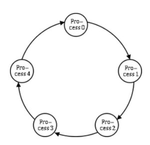
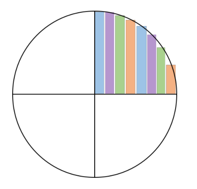
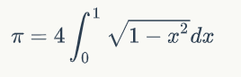
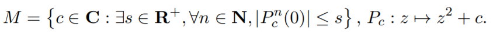
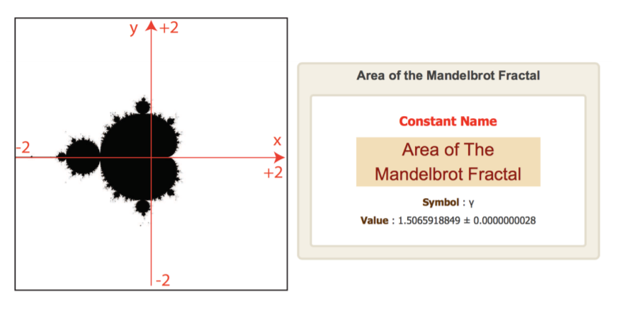

# 并行与分布式计算基础(2019秋)

## 课程基本信息
> * 课程名称：并行与分布式计算基础
> * 英文名称：Foundations of Parallel and Distributed Computing
> * 授课教师：杨超（chao_yang@pku.edu.cn，理科1号楼1520）
> * 课程助教：尹鹏飞（pengfeiyin@pku.edu.cn）
> * 学分：3，周学时：3，总学时：51
> * 考核方式：平时作业(50%) + 期末考试(50%)
> * 教材：无

## 主要授课内容（待定）
> * 引言
> * 硬件体系结构
> * 并行计算模型
> * 编程与开发环境
> * MPI编程与实践
> * OpenMP编程与实践
> * GPU编程与实践
> * 前沿问题选讲

## 课件下载

### 按时间顺序

|           |日期      |   课件
|------     |:---     |:---|
|**Basic**
|第一讲      |2019 09 10| <a href="ppt/fpdc2019_lec01.pdf" target="_blank">fpdc2019_lec01.pdf</a>
|第二讲      |2019 09 12| <a href="ppt/fpdc2019_lec02.pdf" target="_blank">fpdc2019_lec02.pdf</a>
|第三讲(上机) |2019 09 17| <a href="ppt/fpdc2019_lec03.pdf" target="_blank">fpdc2019_lec03.pdf</a> &emsp; <a href="ppt/fpdc2019_lec03-slides.pptx" target="_blank">fpdc2019_lec03-slides.pptx</a> &emsp; <a href="_media/login-win.mp4" target="_blank">login-win.mp4</a>
|第四讲      |2019 09 24| <a href="ppt/fpdc2019_lec04.pdf" target="_blank">fpdc2019_lec04.pdf</a>
|**MPI**
|第五讲      |2019 09 26| <a href="ppt/fpdc2019_lec05.pdf" target="_blank">fpdc2019_lec05.pdf</a> &emsp; <a href="ppt/mpi-ex1.tgz" target="_blank">mpi-ex1.tgz</a>
|第六讲      |2019 10 08| <a href="ppt/fpdc2019_lec06.pdf" target="_blank">fpdc2019_lec06.pdf</a> &emsp; <a href="ppt/mpi-ex2.tgz" target="_blank">mpi-ex2.tgz</a>
|第七讲      |2019 10 10| <a href="ppt/fpdc2019_lec07.pdf" target="_blank">fpdc2019_lec07.pdf</a> &emsp; <a href="ppt/mpi-ex3.tgz" target="_blank">mpi-ex3.tgz</a>
|第八讲(上机) |2019 10 15| <a href="ppt/fpdc2019_lec08.pdf" target="_blank">fpdc2019_lec08.pdf</a> &emsp; <a href="ppt/fpdc2019_lec08-slides.pptx" target="_blank">fpdc2019_lec08-slides.pptx</a> &emsp; <a href="ppt/bash_history_liuhy" target="_blank">bash_history_liuhy</a>
|第九讲      |2019 10 22| <a href="ppt/fpdc2019_lec09.pdf" target="_blank">fpdc2019_lec09.pdf</a> &emsp; <a href="ppt/mpi-ex4.tgz" target="_blank">mpi-ex4.tgz</a>
|**OpenMP**
|第十讲      |2019 10 24| <a href="ppt/fpdc2019_lec10.pdf" target="_blank">fpdc2019_lec10.pdf</a> &emsp; <a href="ppt/omp-ex1.tgz" target="_blank">omp-ex1.tgz</a>
|第十一讲      |2019 10 29| <a href="ppt/fpdc2019_lec11.pdf" target="_blank">fpdc2019_lec11.pdf</a> &emsp; <a href="ppt/omp-ex2.tgz" target="_blank">omp-ex2.tgz</a>
|第十二讲      |2019 11 05| <a href="ppt/fpdc2019_lec12.pdf" target="_blank">fpdc2019_lec12.pdf</a>
|第十三讲      |2019 11 07| <a href="ppt/fpdc2019_lec13.pdf" target="_blank">fpdc2019_lec13.pdf</a> &emsp; <a href="ppt/omp-ex3.tgz" target="_blank">omp-ex3.tgz</a>
|第十四讲      |2019 11 12| <a href="ppt/fpdc2019_lec14.pdf" target="_blank">fpdc2019_lec14.pdf</a> &emsp; <a href="ppt/omp-ex4.tgz" target="_blank">omp-ex4.tgz</a>
|**GPU**
|第十五讲      |2019 11 19| <a href="ppt/fpdc2019_lec15.pdf" target="_blank">fpdc2019_lec15.pdf</a> &emsp; <a href="ppt/cuda-ex1.tgz" target="_blank">cuda-ex1.tgz</a>
|第十六讲      |2019 11 21| <a href="ppt/fpdc2019_lec16.pdf" target="_blank">fpdc2019_lec16.pdf</a> &emsp; <a href="ppt/cuda-ex2.tgz" target="_blank">cuda-ex2.tgz</a>
|翻转课堂      |2019 11 26| 
|第十七讲      |2019 12 03| <a href="ppt/fpdc2019_lec17.pdf" target="_blank">fpdc2019_lec17.pdf</a> &emsp; <a href="ppt/cuda-ex3.tgz" target="_blank">cuda-ex3.tgz</a> &emsp; <a href="ppt/cuda-ex4.tgz" target="_blank">cuda-ex4.tgz</a>
|第十八讲（客座讲座）|2019 12 05| 授课人：颜深根博士(商汤科技) <br> <a href="ppt/2019-12-5.pdf" target="_blank">大规模异构计算-深度学习背后的驱动力量.pdf</a> 
|第十九讲      |2019 12 10| <a href="ppt/fpdc2019_lec19.pdf" target="_blank">fpdc2019_lec19.pdf</a> &emsp; <a href="ppt/cuda-ex5.tgz"  target="_blank">cuda-ex5.tgz</a>
|翻转课堂      |2019 12 17| 
|第二十讲（客座讲座）|2019 12 19| 授课人：徐小文研究员(九所) <br> 基于超级计算的数值装备：典型案例介绍与挑战
|第二十一讲    |2019 12 24| <a href="ppt/fpdc2019_lec21.pdf" target="_blank">fpdc2019_lec21.pdf</a> &emsp; <a href="ppt/fpdc2019_exam_sample.pdf"  target="_blank">fpdc2019_exam_sample</a>


### 按模块汇总

|内容       |课件      
|------     |:---     
|Basic      | <a href="ppt_part/fpdc2019_part1_basic.pdf" target="_blank">fpdc2019_part1_basic.pdf</a>
|MPI        | <a href="ppt_part/fpdc2019_part2_mpi.pdf" target="_blank">fpdc2019_part2_mpi.pdf</a>
|OpenMP     | <a href="ppt_part/fpdc2019_part3_openmp.pdf" target="_blank">fpdc2019_part3_openmp.pdf</a>
|GPU        | <a href="ppt_part/fpdc2019_part4_cuda.pdf" target="_blank">fpdc2019_part4_cuda.pdf</a>
|References        | <a href="ppt_part/fpdc2019_part0_ref.pdf" target="_blank">fpdc2019_part0_ref.pdf</a>


## 关于翻转课堂(Flipped Class)
- 本学期课时较为充足，我打算尝试给有兴趣的同学提供机会上台，
也就是目前流行的“翻转课堂”(Flipped Classroom)。
- 具体要求：
> 1. 提前一周向助教发申请并提供大纲或初步的 slides 供审核；
> 2. 视情况共安排约 4 人上台，每人讲 50 分钟 (含问答)；
> 3. 内容要与课程有相关性，可围绕教学，也可围绕研究课题；
> 4. 讲稿需保持自我完整性，易于理解，没有突兀或戛然而止。
- Benefit：视情况对参与翻转课堂讲解的同学奖励 1-10 分平时分。

关于翻转课堂有任何想法欢迎与助教联系^_^(pengfeiyin@pku.edu.cn)

[^_^]: 注释

<!--
- 第一讲 2019 09 10 &emsp; &emsp;
[fpdc2019_lec01.pdf](https://www.baidu.com)

- 第二讲 2019 09 12 &emsp; &emsp;
[fpdc2019_lec02.pdf]()

- 第三讲 2019 09 17(上机) 
[fpdc2019_lec03.pdf]() &emsp;
[fpdc2019_lec03-slides.pptx]()

- 第四讲 2019 09 24 &emsp; &emsp;
[fpdc2019_lec04.pdf]()

- 第五讲 2019 09 26 &emsp; &emsp;
[fpdc2019_lec05.pdf]() &emsp;
[mpi-ex1.tgz]()

```
cp /mnt/lustrefs/share/fpdc2019/mpi-ex1.tgz mpi-ex1.tgz
tar -zxvf mpi-ex1.tgz
cd mpi-ex1/
module add mpich
make
salloc mpiexec -np 4 ./hello
```
[filename](./_coverpage.md ':include :type=code :fragment=demo')
-->

## 上机作业

### 第一次作业：击鼓传花(2019 10 08)
#### 作业要求
- **Deadline: 2019 年 10 月 23 日 24 点前**
- 完成击鼓传花程序，要求用MPI点对点通信，在此基础上可以增加对延迟的测试内容，程序需要有简单的说明；
- 提交方式：发送至助教邮箱(pengfeiyin@pku.edu.cn)；
  邮件标题：**姓名-学号-第一次作业**；压缩包命名：**学号**；至少包含c文件和makefile文件（已经提交的同学不必担心，本次不会把提交格式作为扣分点）；
- 正确性验证：数院机器，支持2至16进程（以8进程为例）；



``` shell
$ mpiexec -n 8 ./mpi_hw1
Process 1 received token  -1 from process 0
Process 2 received token  -1 from process 1
Process 3 received token  -1 from process 2
Process 4 received token  -1 from process 3
Process 5 received token  -1 from process 4
Process 6 received token  -1 from process 5
Process 7 received token  -1 from process 6
Process 0 received token  -1 from process 7
```
- [Score_hw1](http://mu2.davidandjack.cn/~fpdc2019/#/score/score1.md)

------
### 第二次作业：计算π(2019 10 29)
#### 作业要求


- 用 OpenMP 编写程序计算π，**必须**利用如下数值积分公式：



- 要求数值积分所用离散点个数 **n<= 111111 (六个1)**；
- 可自选并行策略，可自选 OpenMP 中任意并行方式；
- 规定数据类型用 double 或者 long double；
- 评分依据：2 至 16 线程正确，**8 线程精度高** (时间不超过10秒钟)；
- 截止时间：2019 年 **11 月 12 日 24 点**前；


#### 提交内容
- 提交方式：发送至助教邮箱(pengfeiyin@pku.edu.cn)，邮件标题：**姓名-学号-第二次作业**；
- 提交包含四个文件 <font color=red face="黑体">**omp_hw2.c/cpp, Makefile, run.slurm, report.\***</font> 的压缩包， 压缩包命名为**学号**；
- report 中主要写明程序所用**并行策略**，**数值积分算法**，以及程序在线程数为2，8，16时的**运行结果和简要分析**；
- 建议源码中不要设置线程数(方便在shell中修改)，在run.slurm中分别export OMP_NUM_THREADS=2，8，16； 例：
``` shell
export OMP_NUM_THREADS=2
./cpi
export OMP_NUM_THREADS=8
./cpi
export OMP_NUM_THREADS=16
./cpi
```
- 建议输出格式:
``` shell
 Number of intervals = 111111
 Number of threads = 8
 pi is approximately 3.14159265360070938865
 Error is 1.092e-11
 Wall clock time = 0.012766
```
- [Score_hw2](http://mu2.davidandjack.cn/~fpdc2019/#/score/score2.md)

------
### 第三次作业：计算 Mandelbrot Set 的面积(2019 11 13)
#### 作业要求
- Mandelbrot Set:




要求:
- 数院机器，MPI 或 OpenMP 并行，8 个核；
- 用墙钟时间函数完整计时 (从程序开始到结束)；
- 提交时间：2019 年 11 月 28 日 24 点前发给助教。

计分方式：
- 正确性：误差小于 5 × 10−5，否则无效；
- 性能：时间越短分数越高，超过 5 分钟不得分。

思路提示：
- 模型：迭代上界 s = 2，大于 2 则逃逸；
- 算法：Monte Carlo 法、grid search 法；
- 实现：减小搜索区域，提高负载平衡，降低任务额外开销等。

#### 提交内容

- 提交方式：发送至助教邮箱(pengfeiyin@pku.edu.cn)，邮件标题：**姓名-学号-第三次作业**；
- 提交包含四个文件 <font color=red face="黑体">**omp_hw3.c/cpp, Makefile, run.slurm, report.\***</font> 的压缩包， 压缩包命名为**学号**；
- report 中主要写明程序所用**算法**，**并行方案**，**主要参数说明**，以及程序的**运行结果和简要分析**；
- 建议输出格式(误差用科学计数法输出)：
```shell
    Number of threads = 8
    The real area is approximately 1.5065918849
    The calculated area is 1.5066167499586602
    The error is 2.487e-005
    Wall clock time = xxx
```
- [Score_hw3](http://mu2.davidandjack.cn/~fpdc2019/#/score/score3.md)

------
### 第四次作业：修改GPU矩阵乘优化版程序(2019 12 10)
#### 作业要求
- 提交时间：2019 年 12 月 23 日 24 点前。
- 目前矩阵乘的计算程序 cuda-ex5 包含了两条基本假设：<br/>
假设一：矩阵宽度刚好是线程块宽度的整数倍.<br/>
假设二：矩阵是方阵.<br/>
放宽假设：<br/>
如果矩阵宽度不是线程块宽度的整数倍怎么办？<br/>
如果矩阵不是方阵怎么办？

- 作业：修改**cuda-ex5**中的程序，使程序可以满足上述两个条件。
- **固定BLOCK_WIDTH = 16**； 依然取数据分块大小TILE_WIDTH = BLOCK_WIDTH；
- 对性能不做特别要求，尽量少的修改Kernel部分代码；

```C
#define BLOCK_WIDTH 16
#define TILE_WIDTH  BLOCK_WIDTH
dim3 block_dim(BLOCK_WIDTH, BLOCK_WIDTH, 1);
```
#### 提交内容

- 提交方式：发送至助教邮箱(pengfeiyin@pku.edu.cn)，邮件标题：**姓名-学号-第四次作业**；
- 可以对cuda-ex5中的代码直接修改，添加报告<font color=red face="黑体">**report.\***</font>并提交压缩包， 压缩包命名为**学号**；
- report 中至少包含一次运行结果，矩阵不是方阵且长宽不能被线程块宽度整除,可以对性能做简要分析，其余自由发挥；
- 建议在run.slurm中可以直接修改矩阵的三个参数m,p,n,（M大小为m\*p, N大小为p\*n）程序示例如下：(记号和默认大小不必和示例一样)
```C
int m = 500;  // default value
int p = 1000;  // default value
int n= 1500;  // default value
if (argc > 1) {
    m = atoi(argv[1]); // user-specified value
    p = atoi(argv[2]); // user-specified value
    n = atoi(argv[3]); // user-specified value
}
float* M = rand_mat(m, p);
float* N = rand_mat(p, n);
float* cpu_P = raw_mat(m, n);
float* gpu_P = raw_mat(m, n);
```
run.slurm:
```
m=501, p=1001, n=1501;
./mat_mul $m $p $n
```
- [Score_hw4](http://mu2.davidandjack.cn/~fpdc2019/#/score/score4.md)


